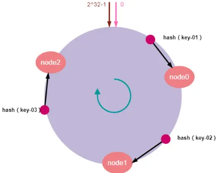

# HASH算法

## 一致性HASH算法

一致性HASH算法主要应用于分布式系统中，需要对资源进行弹性伸缩的情况

解决了普通HASH取模算法无法对服务器进行弹性伸缩（服务器扩容或者服务器节点宕机）的情况

### 工作原理

一致性HASH算法主要是通过对$2^{32}-1$（通常取HASH可能的范围的最大值，一般用于IP地址取模，而IP地址总共有$2^{32}$个）进行取模，并将所有的Hash值映射成一个圆环，0和$2^{32}-1$相连。


对应的节点映射到Hash环上


对应访问的key通过Hash取模后，映射到Hash环，并顺时针查找节点，找到的第一个节点就是所需要取的值



节点扩容的情况


节点增加


### 存在的问题

**数据倾斜**

由于Hash算法计算的随机性，可能导致大量Key会集中访问到同一个节点上


**解决方案**

增加虚拟节点，将虚拟节点映射到对应的实际节点上


### 代码

**节点代码**

```java
public class Node {
    private static final int VIRTUAL_NODE_NO_PER_NODE = 200;
    private final String ip;
    private final List<Integer> virtualNodeHashes = new ArrayList<>(VIRTUAL_NODE_NO_PER_NODE);
    private final Map<Object, Object> cacheMap = new HashMap<>();

    public Node(String ip) {
        Objects.requireNonNull(ip);
        this.ip = ip;
        initVirtualNodes();
    }


    private void initVirtualNodes() {
        String virtualNodeKey;
        for (int i = 1; i <= VIRTUAL_NODE_NO_PER_NODE; i++) {
            virtualNodeKey = ip + "#" + i;
            virtualNodeHashes.add(HashUtils.hashcode(virtualNodeKey));
        }
    }

    public void addCacheItem(Object key, Object value) {
        cacheMap.put(key, value);
    }


    public Object getCacheItem(Object key) {
        return cacheMap.get(key);
    }


    public void removeCacheItem(Object key) {
        cacheMap.remove(key);
    }


    public List<Integer> getVirtualNodeHashes() {
        return virtualNodeHashes;
    }

    public String getIp() {
        return ip;
    }
}

```

**核心实现**

```java
public class ConsistentHash {
    private final TreeMap<Integer, Node> hashRing = new TreeMap<>();

    public List<Node> nodeList = new ArrayList<>();

    /**
     * 增加节点
     * 每增加一个节点，就会在闭环上增加给定虚拟节点
     * 例如虚拟节点数是2，则每调用此方法一次，增加两个虚拟节点，这两个节点指向同一Node
     * @param ip
     */
    public void addNode(String ip) {
        Objects.requireNonNull(ip);
        Node node = new Node(ip);
        nodeList.add(node);
        for (Integer virtualNodeHash : node.getVirtualNodeHashes()) {
            hashRing.put(virtualNodeHash, node);
            System.out.println("虚拟节点[" + node + "] hash:" + virtualNodeHash + "，被添加");
        }
    }

    /**
     * 移除节点
     * @param node
     */
    public void removeNode(Node node){
        nodeList.remove(node);
    }

    /**
     * 获取缓存数据
     * 先找到对应的虚拟节点，然后映射到物理节点
     * @param key
     * @return
     */
    public Object get(Object key) {
        Node node = findMatchNode(key);
        System.out.println("获取到节点:" + node.getIp());
        return node.getCacheItem(key);
    }

    /**
     * 添加缓存
     * 先找到hash环上的节点，然后在对应的节点上添加数据缓存
     * @param key
     * @param value
     */
    public void put(Object key, Object value) {
        Node node = findMatchNode(key);

        node.addCacheItem(key, value);
    }

    /**
     * 删除缓存数据
     */
    public void evict(Object key) {
        findMatchNode(key).removeCacheItem(key);
    }


    /**
     *  获得一个最近的顺时针节点
     * @param key 为给定键取Hash，取得顺时针方向上最近的一个虚拟节点对应的实际节点
     *      * @return 节点对象
     * @return
     */
    private Node findMatchNode(Object key) {
        Map.Entry<Integer, Node> entry = hashRing.ceilingEntry(HashUtils.hashcode(key));
        if (entry == null) {
            entry = hashRing.firstEntry();
        }
        return entry.getValue();
    }
}
```


参考

[图解一致性哈希算法，看这一篇就够了！ -阿里云开发者社区](https://developer.aliyun.com/article/1082388)

# 排序算法

## 冒泡排序

时间复杂度:O(n^2) 

空间复杂度:O(1)

### 算法步骤

1. 比较相邻的元素。如果第一个比第二个大，就交换他们两个。 

2. 对每一对相邻元素做同样的工作，从开始第一对到结尾的最后一对。在这一点，最后的元素应该会是最大的数。

3. 针对所有的元素重复以上的步骤，除了最后一个。 

持续每次对越来越少的元素重复上面的步骤，直到没有任何一对数字需要比较。

### 代码

```java

```


## 快速排序

### 算法步骤

1. 从数列中挑出一个元素，称为 "基准"（pivot）;
2. 重新排序数列，所有元素比基准值小的摆放在基准前面，所有元素比基准值大的摆在基准的后面（相同的数可以到任一边）。在这个分区退出之后，该基准就处于数列的中间位置。这个称为分区（partition）操作；
3. 递归地（recursive）把小于基准值元素的子数列和大于基准值元素的子数列排序；

### 代码

```java
public class QuickSort implements IArraySort {

    @Override
    public int[] sort(int[] sourceArray) throws Exception {
        // 对 arr 进行拷贝，不改变参数内容
        int[] arr = Arrays.copyOf(sourceArray, sourceArray.length);

        return quickSort(arr, 0, arr.length - 1);
    }

    private int[] quickSort(int[] arr, int left, int right) {
        // 如果left >= right 表示只有yi
        if (left < right) {
            // 分区边界
            int partitionIndex = partition(arr, left, right);
            // 分区之后的2个区域分别重复分区，直到left>=right（表示只有一个数了）时结束分区
            quickSort(arr, left, partitionIndex - 1);
            quickSort(arr, partitionIndex + 1, right);
        }
        return arr;
    }

    private int partition(int[] arr, int left, int right) {
        // 设定基准值（pivot）
        int pivot = left;
        // 交换次数，用于确定边界，边界左边小于基准值，边界右边大于基准值
        int index = pivot + 1;
        for (int i = index; i <= right; i++) {
            if (arr[i] < arr[pivot]) {
                swap(arr, i, index);
                index++;
            }
        }
        // 将基准值放到边界上
        swap(arr, pivot, index - 1);
        return index - 1;
    }

    private void swap(int[] arr, int i, int j) {
        int temp = arr[i];
        arr[i] = arr[j];
        arr[j] = temp;
    }

}
```

## 归并排序

通过分治思想+合并有序数组实现的一种排序算法

这种排序通常可以用在有内存限制的情况下，通过额外使用磁盘上的空间来进行的大数据量排序

### 步骤

1. 通过递归，将数组以对半均分的方式，均分到只有一个元素
2. 通过合并有序数组的方式，从单元素数组开始，将数组进行两两合并，最终得到一个有序数组

可以通过以开始下标+结束下标的方式来减少零时数组的创建

### 代码

```java
public class MergeSort  implements IArraySort{
    public static void main(String []args){
        int []arr = {9,8,7,6,5,4,3,2,1};
        sort(arr);
        System.out.println(Arrays.toString(arr));
    }
    public static void sort(int []arr){
        // 创建临时数组，用于存放合并数组时，临时产生的
        int []temp = new int[arr.length];
        sort(arr,0,arr.length-1,temp);
    }
    private static void sort(int[] arr,int left,int right,int []temp){
        if(left<right){
            // 均分数组
            int mid = (left+right)/2;
            sort(arr,left,mid,temp);//左边归并排序，使得左子序列有序
            sort(arr,mid+1,right,temp);//右边归并排序，使得右子序列有序
            merge(arr,left,mid,right,temp);//将两个有序子数组合并操作
        }
    }
    private static void merge(int[] arr,int left,int mid,int right,int[] temp){
        int i = left;//左序列指针
        int j = mid+1;//右序列指针
        int t = 0;//临时数组指针
        while (i<=mid && j<=right){
            if(arr[i]<=arr[j]){
                temp[t++] = arr[i++];
            }else {
                temp[t++] = arr[j++];
            }
        }
        while(i<=mid){//将左边剩余元素填充进temp中
            temp[t++] = arr[i++];
        }
        while(j<=right){//将右序列剩余元素填充进temp中
            temp[t++] = arr[j++];
        }
        t = 0;
        //将temp中的元素全部拷贝到原数组中
        while(left <= right){
            arr[left++] = temp[t++];
        }
    }
}
```

参考

[图解排序算法(四)之归并排序 - dreamcatcher-cx - 博客园](https://www.cnblogs.com/chengxiao/p/6194356.html)
