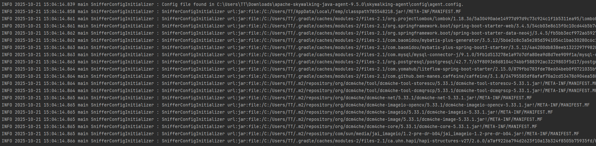
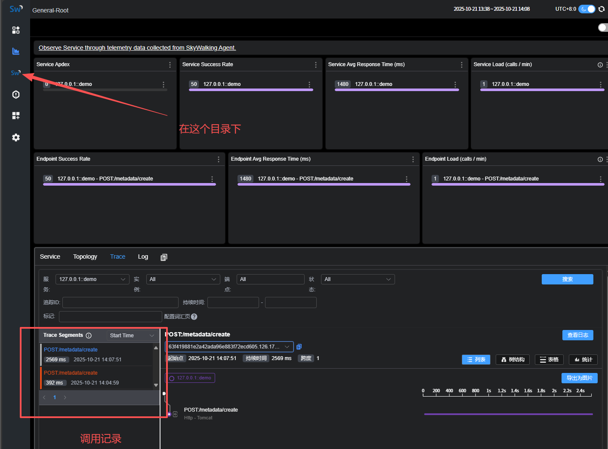

# windows环境部署与使用

**Elasticsearch（前置）**

1. 下载，SkyWalking暂时不支持9.x版本，此处使用8.x最新版本8.19

2. 双击bin/elasticsearch.bat，记录控制台打印的账号密码

3. 获取ssl证书密码，下一步将.p12证书转成.jks证书需要

   ```shell	
   bin/elasticsearch-keystore show xpack.security.http.ssl.keystore.secure_password
   ```

4. 将.p12证书转成.jks证书，并设置密码为上一步打印的内容（.p12证书在config/下）

   ```shell
   keytool -importkeystore -srckeystore http.p12 -srcstoretype PKCS12 -deststoretype JKS -destkeystore http.jks
   ```

**SkyWalking**

1. 官网下载SkyWalking APM

2. 修改config/applicationyml

   ```yaml
   # ...
   storage:
     selector: ${SW_STORAGE:elasticsearch} # ←此处修改为elasticsearch
     banyandb:
       # Since 10.2.0, the banyandb configuration is separated to an independent configuration file: `bydb.yaml`.
     elasticsearch:
       protocol: ${SW_STORAGE_ES_HTTP_PROTOCOL:"https"} # 修改为https，因为es8.x版本默认开启https
       user: ${SW_ES_USER:"elastic"} # es默认用户
       password: ${SW_ES_PASSWORD:"BZDn2dfrh06UzA6OIg7O"} # 会在第一次启动时打印在控制台，如果忘记可以使用elasticsearch-reset-password.bat -u [用户名:elastic] --url [es地址:https://127.0.0.1:9200] 来重置密码
       trustStorePath: ${SW_STORAGE_ES_SSL_JKS_PATH:"D:\\http.jks"} # 这里使用安装es时第四步生成的jks文件，路径最好不要有空格
       trustStorePass: ${SW_STORAGE_ES_SSL_JKS_PASS:"gg2HLdHFSauuWyMpKoSoGQ"} # 这里使用安装es时第三步打印出来的密码
   ```

3. 打开bin/startup.bat启动，如果启动失败可以查看logs文件夹下的日志

4. 访问127.0.0.1:8080（默认是这个地址）

**代理Java服务**

1. 准备一个Springboot web项目

2. 下载Skywalking-Agent（Java Agent）

3. 修改config/agent.config

   ```config
   # 服务名称,需要在Jar包启动时配置
   agent.service_name=127.0.0.1::${SW_SERVICE_NAME}
   # ...
   # 修改为skywalking部署的地址，11800是skywalking的oap服务的端口
   collector.backend_service=${SW_AGENT_COLLECTOR_BACKEND_SERVICES:127.0.0.1:11800}
   ```

4. 配置JVM参数,（skywalking-agent.jar在Agent根目录下）

   ```shell
   # e.g. java -javaagent:/usr/local/skywalking-agent/skywalking-agent.jar -DSW_SERVICE_NAME=demo -jar demo.jar
   -javaagent:/usr/local/skywalking-agent/skywalking-agent.jar -DSW_SERVICE_NAME=demo
   ```

5. 启动服务，会看到如下日志就代表代理成功

   

6. 随便访问一个服务内的Http接口，即可以在127.0.0.1:8080上查看到

   

