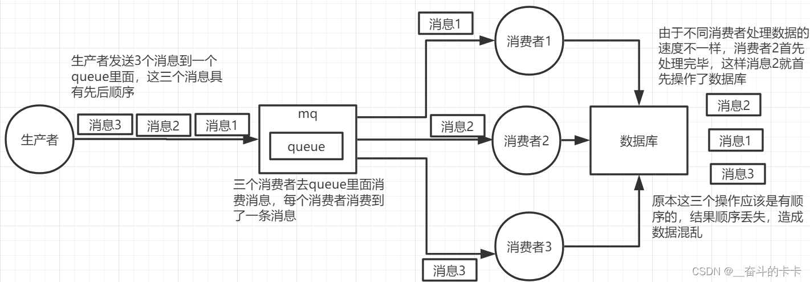
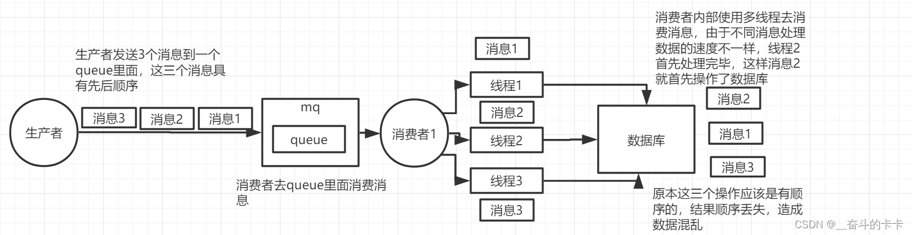
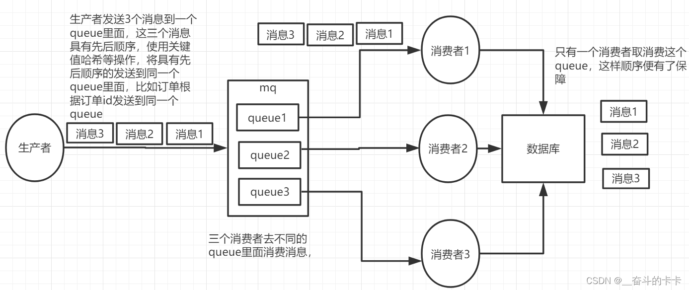
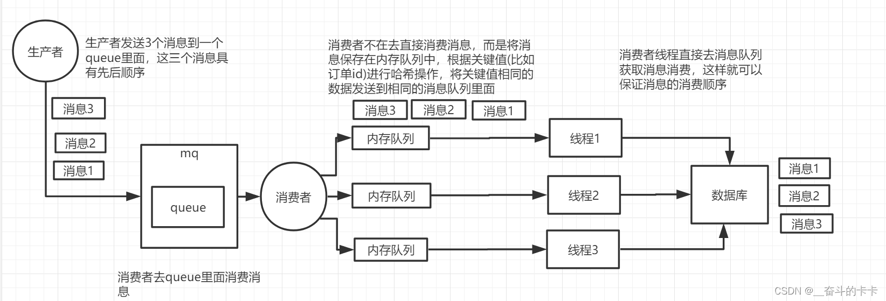

# Java源码

## 当百万数据存入HashMap中会发生什么事情

1. 如果计算机内存不足，可能会导致OutOfMemoryException（内存溢出）
2. 如果内存充足的情况下，因为HashMap是通过数组＋链表／红黑树实现，再百万存入数据过程中可能会发生大量的Hash冲突，导致链表变长，当超过８时，挂载在数组上的链表会转变成红黑树。

## JUC

### ConcurrentHashMap


# Spring

## 过滤器、拦截器、AOP区别与联系

过滤器：仅仅只是拦截请求，依赖于Servlet容器，通过Java的回调机制进行实现

拦截器：基于Java的反射机制实现

AOP：面向切面编程，可以通过JDK原生实现，不用依赖第三方，可以在调用方法的前后执行

## Spring Filter使用的什么模式

责任链模式

# Mybatis

## 缓存机制

**一级缓存**

mybatis的一级缓存通过localCacheScope进行开启(默认开启)

```xml
<setting name="localCacheScope" value="SESSION"/>		
```

在同一个SqlSession中,如果使用相同条件查询(没有插入修改语句),mybatis只有在第一次回去查询数据库

```java
SqlSession sqlSession = sqlSessionFactory.openSession(true);
StudentMapper mapper = sqlSession.getMapper(StudentMapper.class);
System.out.println("first query");
mapper.selectByPrimaryKey(4L);
System.out.println("second query");
mapper.selectByPrimaryKey(4L);
System.out.println("third query");
mapper.selectByPrimaryKey(4L);
```

如果控制台打印了Sql语句,可以发现只有在first query后面打印了Sql语句

```
first query
2022-03-11 14:24:35.186  INFO 3796 --- [           main] com.zaxxer.hikari.HikariDataSource       : HikariPool-1 - Starting...
2022-03-11 14:24:36.145  INFO 3796 --- [           main] com.zaxxer.hikari.HikariDataSource       : HikariPool-1 - Start completed.
JDBC Connection [HikariProxyConnection@1841440668 wrapping com.mysql.cj.jdbc.ConnectionImpl@7d7b4e04] will not be managed by Spring
==>  Preparing: select id,name,age from student where id = ?
==> Parameters: 4(Long)
<==    Columns: id, name, age
<==        Row: 4, Rose, 15
<==      Total: 1
second query
third query

```

不过当遇到DML语句时,一级缓存就会失效

```java
SqlSession sqlSession = sqlSessionFactory.openSession(true);
StudentMapper mapper = sqlSession.getMapper(StudentMapper.class);

Student student = mapper.selectByPrimaryKey(4L);
System.out.println(student);
int i = mapper.insertStudent(buildStudent());
System.out.println("insert count:" + i);
mapper.selectByPrimaryKey(4L);
```

查询主键为4的学生后,向表中插入一条学生记录,再次查询主键为4的学生,这时mybatis会去查询数据库,而非使用缓存

```
==>  Preparing: select id,name,age from student where id = ?
==> Parameters: 4(Long)
<==    Columns: id, name, age
<==        Row: 4, Rose, 15
<==      Total: 1
Student(id=4, name=Rose, age=15)
==>  Preparing: insert into student(name, age) values (?, ?)
==> Parameters: df08c4aa-649c-4337-920f-ec68a89962fd(String), 23(Integer)
<==    Updates: 1
insert count:1
==>  Preparing: select id,name,age from student where id = ?
==> Parameters: 4(Long)
<==    Columns: id, name, age
<==        Row: 4, Rose, 15
<==      Total: 1
```

第二次查询会有SQL语句打印

mybatis的一级缓存的范围仅限于当前SqlSession,而且另一个SqlSession的DDL并不会使当前的SqlSession的缓存失效

```java
SqlSession sqlSession1 = sqlSessionFactory.openSession(true);
SqlSession sqlSession2 = sqlSessionFactory.openSession(true);

StudentMapper mapper1 = sqlSession1.getMapper(StudentMapper.class);
StudentMapper mapper2 = sqlSession2.getMapper(StudentMapper.class);

System.out.println(mapper1.selectByPrimaryKey(5L));
System.out.println(mapper2.selectByPrimaryKey(5L));

int jack = mapper1.updateStudentName("Jack", 5L);
System.out.println("mapper1 update count:" + jack);

System.out.println(mapper1.selectByPrimaryKey(5L));
System.out.println(mapper2.selectByPrimaryKey(5L));
```

2个SqlSession同时查询,其中一个修改了表数据,,第二次查询其中一个返回的时Jack另一个返回的应该时原数据,

> 注:Springboot使用autowired的mapper需要在方法上添加@Transactional,不然每次查询都会新创建一个SqlSession

```
==>  Preparing: select id,name,age from student where id = ?
==> Parameters: 5(Long)
<==    Columns: id, name, age
<==        Row: 5, Jack, 19
<==      Total: 1
Student(id=5, name=Jack, age=19)
JDBC Connection [HikariProxyConnection@436338687 wrapping com.mysql.cj.jdbc.ConnectionImpl@a99c42c] will not be managed by Spring
==>  Preparing: select id,name,age from student where id = ?
==> Parameters: 5(Long)
<==    Columns: id, name, age
<==        Row: 5, Jack, 19
<==      Total: 1
Student(id=5, name=Jack, age=19)
==>  Preparing: update student set name = ? where id =?
==> Parameters: Jhon(String), 5(Long)
<==    Updates: 1
mapper1 update count:1
==>  Preparing: select id,name,age from student where id = ?
==> Parameters: 5(Long)
<==    Columns: id, name, age
<==        Row: 5, Jhon, 19
<==      Total: 1
Student(id=5, name=Jhon, age=19)
Student(id=5, name=Jack, age=19)
```

**二级缓存**

二级缓存由多个SqlSessio共享,

启用二级缓存需要在配置文件中启用

```xml
<setting name="cacheEnabled" value="true"/>
```

然后再对应的映射xml中使用cache标签声明这个namespace使用二级缓存

```xml
<cache/>
```

想要二级缓存生效,SqlSession必须提交,

```java
SqlSession sqlSession1 = sqlSessionFactory.openSession(true);
SqlSession sqlSession2 = sqlSessionFactory.openSession(true);

StudentMapper mapper1 = sqlSession1.getMapper(StudentMapper.class);
StudentMapper mapper2 = sqlSession2.getMapper(StudentMapper.class);

Student student = mapper1.selectByPrimaryKey(4L);
System.out.println(student);
// 如果sqlSession1没有提交,mapper2的查询还是会走数据库
sqlSession1.commit();
Student student1 = mapper2.selectByPrimaryKey(4L);
System.out.println(student1);
```

二级缓存仍然会因为DDL语句而失效

```java
SqlSession sqlSession1 = sqlSessionFactory.openSession(true);
SqlSession sqlSession2 = sqlSessionFactory.openSession(true);
SqlSession sqlSession3 = sqlSessionFactory.openSession(true);

StudentMapper mapper1 = sqlSession1.getMapper(StudentMapper.class);
StudentMapper mapper2 = sqlSession2.getMapper(StudentMapper.class);
StudentMapper mapper3 = sqlSession3.getMapper(StudentMapper.class);

Student student = mapper1.selectByPrimaryKey(4L);
System.out.println(student);
sqlSession1.commit();

Student student1 = mapper2.selectByPrimaryKey(4L);
System.out.println(student1);

mapper3.updateStudentName("小明",4L);
sqlSession3.commit();

Student student2 = mapper2.selectByPrimaryKey(4L);
System.out.println(student2);

```

第二次查询走的缓存,第三次查询因为前面由DDL语句,则走的是数据库

```
JDBC Connection [@59320794 wrapping com.mysql.cj.jdbc.ConnectionImpl@69d667a5] will not be managed by Spring
==>  Preparing: select id,name,age from student where id = ?
==> Parameters: 4(Long)
<==    Columns: id, name, age
<==        Row: 4, Rose, 15
<==      Total: 1
Student(id=4, name=Rose, age=15)
As you are using functionality that deserializes object streams, it is recommended to define the JEP-290 serial filter. Please refer to https://docs.oracle.com/pls/topic/lookup?ctx=javase15&id=GUID-8296D8E8-2B93-4B9A-856E-0A65AF9B8C66
Cache Hit Ratio [com.fool.mybatiscache.mapper.StudentMapper]: 0.5
Student(id=4, name=Rose, age=15)
JDBC Connection [HikariProxyConnection@1111497601 wrapping com.mysql.cj.jdbc.ConnectionImpl@f1d1463] will not be managed by Spring
==>  Preparing: update student set name = ? where id =?
==> Parameters: 小明(String), 4(Long)
<==    Updates: 1
Cache Hit Ratio [com.fool.mybatiscache.mapper.StudentMapper]: 0.3333333333333333
JDBC Connection [HikariProxyConnection@1780974980 wrapping com.mysql.cj.jdbc.ConnectionImpl@28f90752] will not be managed by Spring
==>  Preparing: select id,name,age from student where id = ?
==> Parameters: 4(Long)
<==    Columns: id, name, age
<==        Row: 4, 小明, 15
<==      Total: 1
Student(id=4, name=小明, age=15)
```

因为二级缓存是根据namespace存储的,不同的namespace(相当于一个mapper.xml)之间不会因为DDL而互相影响,所以可能会导致一个namespace修改了数据,而另一个namespace的缓存没有更新,读取到了缓存中的脏数据

解决二级缓存可能读取到缓存中的脏数据问题,可以使用cache-ref标签引用其他namespace的缓存

```xml
<cache-ref namespace="mapper.StudentMapper"/>
```

引用其他namespace的缓存可能导致粒度变粗,多个namespace下的DDL操作都会对缓存造成影响

**参考资料：**

[聊聊MyBatis缓存机制 - 美团技术团队 (meituan.com)](https://tech.meituan.com/2018/01/19/mybatis-cache.html)

# 消息队列

## 原理

消息队列的本质是一个队列，而队列中存放的是一个个消息。队列是一个数据结构，具有先进先出的特点。消息队列则是将消息放到队列里，用队列做存储消息的介质。在消息队列中，消息的发送方称为生产者，消息的接收方称为消费者。生产者将消息发送到队列中，然后消费者从队列中取出消息进行处理。当消息被消费之后，它就从队列中删除。

消息队列提供了异步的通信协议，每一个队列中的记录包含详细说明的数据，包含发生的时间、输入设备的种类以及特定的输入参数。这意味着消息的发送者和接收者不需要同时与消息队列交互。消息会保存在队列中，直到接收者取回它。

下面通过一个简单的架构模型来解释消息队列的工作原理：

1. Producer（生产者）：负责产生和发送消息到 Broker（消息服务器）。生产者负责将消息发送到消息服务器（Broker）。
2. Broker（消息服务器）：消息处理中心。负责消息存储、确认、重试等，一般其中会包含多个 queue（队列）。Broker 是消息队列的核心部分，负责存储和管理消息。它通常包含多个队列，用于存储生产者发送的消息。
3. Consumer（消费者）：负责从 Broker 中获取消息，并进行相应处理。消费者从 Broker 中获取消息进行处理。消费者可以同时从多个队列中获取消息，也可以对获取的消息进行过滤和选择。
4. Topic（主题）：主题是一种将消息分类的方式，消费者可以根据主题订阅自己感兴趣的消息类型。
5. Queue（队列）：队列是保存消息的容器，生产者将消息发送到队列中，然后消费者从队列中取出消息进行处理。
6. Message（消息体）：消息体是实际的数据内容，包含了生产者发送给消费者的信息。

## 如何保证消息的不丢失

消息的丢失可能存在于三个地方:

1. 消息生成发送到消息队列
2. 消息队列本身存储丢失
3. 消息队列将消息传递给消费者

为了确保消息成功发送到消息队列,在发送消息的时候会有个异步的回调函数,来获取由消息队列返回的ack,来表示消息队列接受到了消息

消息队列中的存储不丢失由消息中间件来保证

最后一步消息的消费,在消费者完成具体的业务逻辑后,返回消息确认的ack给消息队列

通过以上方法来保证消息的不丢失

## 如何保证消息的不重复消费

保证消息的不重复消费即需要实现消费消息的接口的幂等性

首先需要消息带有一个全局唯一的标识,在消费者端对全局唯一标识进行校验

在涉及到金钱等场景需要使用强校验,使用全局唯一标识去数据库表中查询是否存在记录,如果有就return,如果没有就执行业务逻辑,

在不重要的场景使用弱校验即可,将全局唯一标识存入redis缓存中,并设置失效时间,在一定时间内通过判断redis中是否存在来判断

## 消息积压情况如何处理

消息积压,说明消息产生速度远远大于消费的速度,所以问题是出现在消费者端

首先应急可以临时增加消费者端的数量,然后可以通过日志等判断等判断是需要进行代码优化提高消费速度,又或者进行消费者扩容

## 如何保证消费顺序

问题原因：

1. 生产这发送消息到消息队列后,有多个消费者对同一个队列进行消费,可能会导致消费顺序的错乱



2. 生产者发送消息到消息队列后,虽然只有一个消费者进行消费,但是这个消费者对消息进行多线程处理,也可能导致消息的错乱



解决:

原因一解决方案:

根据消费者数量,来决定有多少个消息队列,并将消费者和消息队列进行一一绑定,生产者根据业务的唯一ID进行HASH操作后,发送到对应的消息队列,然后由对应的消费者消费,这样同一个业务下的消息都会由同一个消费者进行消费,这样就不会导致消费顺序错乱



原因二解决方案:

原因二消费顺序错乱的原因是单消费者,但使用了多线程,可以在消费者内部维护多个内存队列,同样也根据业务唯一ID的HASH值进行分发,然后由对应的线程去消费



> [RabbitMQ如何保证消息的顺序性【重点】-CSDN博客](https://blog.csdn.net/weixin_42039228/article/details/123526391)

# Mysql

## 事务隔离

## 模糊查询‘%’所在位置影响是否生效的原因

因为mysql的索引是通过b+树实现的，b+树会将数据顺序的存放在叶子节点中，并且mysql中非聚簇索引中的叶子节点只会存放索引列和主键，所以当模糊查询中，百分号不在查询条件的左侧时，就是说，查询条件的开头时固定的，比如``where name like 'value%'``,可以使用索引快速定位到查询条件的左侧开头的部分``value``，并且从索引中顺序读取后续的记录，因此这种情况下索引生效

## 索引失效的情况

1. 当使用 like 时 % 在前面(e: name like '%Rose'),其他情况诸如在中间以及末尾索引都会生效(e:name like 'R%ose%')

2. 当使用or时可能会失效

   1. or 两边都是同一个表的条件时,两边的字段都是索引时,索引生效(e: s.name = 'rose' or s.age = 14,age 和 name都是索引);当其中一个不是索引的时候,两个字段的索引都不会生效(e: s.remark = '123' or s.name = 'rose', remark 不是索引, name是索引)
   2. or 两边不是同一个表的条件,并且时以join进行关联时,不管主表字段是否时索引字段,只要join表的字段是索引,那么join表的字段索引一定会被触发

3. 使用组合索引时,如果查询条件中没有带有索引第一个字段,则索引失效,

   ```sql
   create index test on student(name,age,sex);
   # 索引生效
   select * from student where name = 'rose' and age =11 and sex = 0;
   # 索引生效
   select * from student where name = 'rose' and sex = 0;
   # 索引未生效
   select * from student where name = 'rose' and age =11 and sex = 0;
   ```

4. 当索引字段冲突时,后面创建的索引失效

5. 当查询字段是varchar时,条件为数字时(e: name = 123, name是varchar),发生隐式转换,会导致索引失效,而当查询字段是数字,而条件是字符串时,索引仍旧为生效

   ```sql
   create index student_name on student(name);
   create index student_age on student(age);
   # 索引失效
   select * from student where name = 123;
   # 索引生效
   select * from student where age = '123';
   ```

6. 对字段进行操作,或者使用函数时索引失效(e: age + 1 = 10;left(name, 2) = 'rose')

7. 使用 !=, not 时索引可能失效,原因就是第八条:当全表扫描速度比索引速度快时，mysql会使用全表扫描，此时索引失效

8. 当全表扫描速度比索引速度快时，mysql会使用全表扫描，此时索引失效。

# Redis

## Redis击穿、穿透、雪崩以及解决方案

击穿、穿透、雪崩等情况都指的是在高并发的情况下

**击穿**
指的是高并发的情况下，单个Key在缓存中查询不到，去数据库查询的情况

解决方案：

1. 设置Value永不过期
2. 使用互斥锁（mutex key）

```java
public String get(key) {
      String value = redis.get(key);
      if (value == null) { //代表缓存值过期
          //设置3min的超时，防止del操作失败的时候，下次缓存过期一直不能load db
          if (redis.setnx(key_mutex, 1, 3 * 60) == 1) {  //代表设置成功
               value = db.get(key);
                      redis.set(key, value, expire_secs);
                      redis.del(key_mutex);

                     return value;
              } else {  //这个时候代表同时候的其他线程已经load db并回设到缓存了，这时候重试获取缓存值即可
                      sleep(10);
                      get(key);  //重试
              }
          } else {
              return value;      
          }

}
```

**雪崩**

雪崩值得是高并发的情况下，多个key查询缓存查询不到，去查询数据库，从而导致数据库压力增加

出现原因：多个Key同时失效或者redis宕机

解决方案：

1. reload机制，通过定时任务等方式，在Key失效前重新加载缓存，更新失效时间
2. 不同的key设置不同的失效时间，使雪崩的情况转换为击穿，并使用击穿的解决方案
3. 使用双缓存策略，分别设置短期、长期2个缓存，当短期缓存失效时，使用长期缓存

**击透**
在高并发的情况下，缓存和数据库中均不存在key所指定的缓存

解决方案：布隆过滤器

## 持久化方式

Redis的持久化方式有RDB和AOF两种方式

RDB持久化是把当前进程数据生成快照保存到磁盘上的过程，由于是某一时刻的快照，那么快照中的值要早于或者等于内存中的值。

RDB优点：

* RDB默认使用LZF算法进行压缩，压缩后的文件体积远远小于内存中的大小，适用于备份、全量复制等场景
* 使用RDB持久化方式，文件恢复要远远快于AOF方式

RDB缺点：

* 实时性不如AOF方式，对于短时间内的持久化比较薄弱
* RDB持久化后生成的文件是二进制的，没有可读性

AOF是将每次执行的命令记录保存，并且Redis采用的是先写内存，后写日志的方式

AOF优点：

* AOF默认保存指令的时间间隔是1秒，提供了数据更高的安全性，避免数据丢失

AOF缺点：

* 对于启动、恢复Redis数据比较慢（针对这个缺点，Redis提供了重写机制）

# 并发

## 幂等性

幂等性指的是在以相同参数重复调用的情况下，对系统产生的影响是一样的

### 幂等性的解决办法

1. 使用数据库主键来保证幂等性，不过需要生产一个全局唯一ID，适用于新增，删除操作
2. 通过添加版本字段来使用乐观锁保证更新的幂等性，每次数据更新都使版本往上自增
3. 使用一次性请求令牌来保证幂等性，每次在请求业务接口之前，先获取一个请求令牌，服务端生成令牌后存入redis，需要保证幂等性的业务接口需要每次校验请求令牌

参考

[一口气说出四种幂等性解决方案，面试官露出了姨母笑~ - 掘金 (juejin.cn)](https://juejin.cn/post/6906290538761158670#heading-19)

## 线程状态

线程状态分别有新键、可运行、阻塞（``Lock``，``synchronized``）、无限期等待（``Object.wait()``）、有限期等待（``Thread.sleep()``）、死亡

## 线程中断方式

1. 正常执行完毕
2. 通过调用``Thread.interrupt()``，来标记线程为中断状态，如果线程处于阻塞、等待（包含有限期与无限期）状态，那么就会抛出``InterruptedException``,如果不处于，那么线程不会中断，但是``interrupted()``方法会返回``true``
3.  线程池中的线程中断
   1. 中断整个线程池线程，调用``shutdownNow()``，相当于线程池中的所有线程都调用了``interrupt()``
   2. 中断线程池中的某个线程，线程池通过``submit()``方法提交一个线程后，会返回一个``Future<?>``对象，通过调用``cancel(true)``即可中断

# 锁

## 死锁产生的原因，如何解决，以及如何避免死锁

**死锁产生的条件：**

1. 互斥条件
2. 持有并等待
3. 不可剥夺
4. 环路等待

**互斥条件**

互斥条件指的是，多个线程不能同时使用同一个资源

**持有并等待条件**

持有并等待条件指的是线程A持有资源1又想申请资源2，而资源2已经被线程C持有，所以线程A就会处于等待状态，但是线程A在等待资源2的时候不会释放资源1

**不可剥夺条件**

不可剥夺条件指的是线程持有的资源在线程自身使用完释放前不能被其他线程获取

**环路等待条件**

环路等待条件值得时两个线程获取资源的混徐构成了环形链，比如线程A持有资源1，请求资源2，线程B持有资源2，请求资源1

**避免死锁发生的方法：**

1. 资源有序分配，线程A和线程B获取资源的顺序要保持一致，比如线程A先尝试获取资源1，再尝试获取资源2，线程B也要保持相同顺序
2. 给锁设置等待时间，超过等待时间，释放资源


## `synchronized` 和 `ReentrantLock` 的区别，如何选择

synchronized是java中的关键字，用于实现多线程下同步功能，ReentrantLock是java自带的api包中的类，也可以实现多线程下同步功能

多线程竞争时，synchronized不可以中断，而ReentrantLock可以调用中断方法或者根据等待时间进行中断，减少了出现死锁的可能性

synchronized是非公平锁，而ReentrantLock可根据不同的情形设置是否是公平锁

synchronized会根据线程竞争程度，从偏向锁，轻量级锁，重量级锁进行升级，到重量级锁时，会阻塞线程，ReentrantLock的核心类Sync实现了AQS，是通过自旋CAS操作实现同步功能，不会阻塞线程

通常情况下建议使用synchronized，如果有需要使用公平锁，中断等待等情形，建议使用ReentrantLock

## synchronized升级

锁升级的方向是无锁->偏向锁->轻量级锁->重量级锁

**无锁 -> 偏向锁**

当只有一个线程访问同步代码块时，会将线程地址放到对象头markword中，用于标记，此时已经升级为偏向锁，当同一个线程下次调用时只需简单判断markword中的地址是否是当前线程地址，即可直接调用。

**偏向锁->轻量级锁**

当有多个线程竞争，线程会在线程本地栈中生成LockRecord，使用CAS（自旋）去竞争对象的Markword的LockRecord指针，CAS成功的则获取轻量级锁，CAS失败的，会继续进行自旋

**轻量级锁->重量级锁**

在竞争轻量级锁中，CAS（自旋）达到一定次数后升级为重量级锁，此后进入竞争的线程会进入阻塞状态


